Social Networks: Exploring and Visualising with Gephi
================

# Introduction

**Do you want to learn a new skill in this Spring Term?** In this workshop we explore how to use the Gephi software to visualise and understand 17th century social networks. Gephi is a free open-source visualization and exploration tool useful for all kinds of graphs and networks. Visual thinking based on interactive interfaces tend to facilitate reasoning and compliment traditional statistics which in turn may enhance hypothesis building, pattern discovery as well as research and teaching generally. This workshop is being delivered by a team of Senior Research Software Engineers from the Centre for Digital Enquiry ([CDI](https://warwick.ac.uk/fac/cross_fac/cdi/)) and Information and Digital Group (IDG) Technology for Research in the University of Warwick.

## Learning objectives

• Upskill yourself with some techniques for exploring and visualizing
social networks

• Load and explore historical network data using Gephi

• Visualise historical network data with Gephi

• Reflect on some of the technicalities around network analysis

## Requirements

• [Gephi software](https://gephi.org/users/download/). You can find an installation guide [here](https://gephi.org/users/install/). If you have Java issues and are a University of Warwick student/staff then please do contact the ITS helpdesk. If you encounter Gephi issues with Java, then you can also look at [this blog post](https://medium.com/coder-snorts/gephi-is-broken-on-mac-os-97fbaef4305e#.cogwsls13) and or video [here](https://www.youtube.com/watch?v=3r3hU_gfcuA) or [there](https://youtu.be/Lv59Lu-Jqxs). *Note:* Gephi is available via the Software Centre if you are using a Windows 10 Managed Laptop.

• Access to a computer with internet connection for downloading data.

• Data source for this workshop: [Quakers](https://github.com/melaniewalsh/sample-social-network-datasets/tree/master/sample-datasets/quakers).

• No prior knowledge of Gephi or social network data is required.

• Up to 2 hours of your time.

• In-person workshop.

# Activity 1: Quakers Network

### Quakers: who are they?

Quakers, also known formally as the ["Religious Society of Friends](https://en.wikipedia.org/wiki/Quakers)", is a society founded in England in the mid-17th century and made up of a historically Protestant Christian set of denominations. Quakers have a believe that each human being has the ability to experience the "light within" or see "that of God in every one". As indicated in the requirements section above, we will use social network data about the relationships between seventeenth-century Quakers; data is a scaled-down version of larger dataset which is a reconstruction of the early modern social network of Britain (1500-1700).

### Setup the folder for your work

Think about where on your computer that you want to work and create a
folder there. Preferably with a short path like “C:\\quakers”.

### Overview of the dataset and tabular content

Download the Quaker dataset as shown below in text and screenshots.

Go to the [sample data sets
page](https://github.com/melaniewalsh/sample-social-network-datasets) ->
Code -> Download Zipped folder into your project folder -> Unzip folder
with software such as [7zip](https://www.7-zip.org/) -> navigate
unzipped folder to “..\\sample-datasets\\quakers\\” and copy files into
your Gephi project folder or keep them where they are and use in your
Gephi project.

|                      |                      |
|----------------------|----------------------|
| 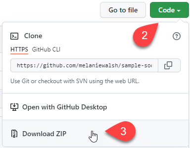 | 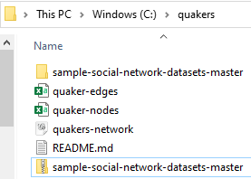 |

We are going to examine the relationships between 17th Century Quakers.
We have downloaded the data from [Melanie Walsh’s GitHub
repository](https://github.com/melaniewalsh/sample-social-network-datasets/tree/master/sample-datasets/quakers)
which contains other network datasets. The original data is taken from
this [excellent Programming Historian
tutorial](https://programminghistorian.org/en/lessons/exploring-and-analyzing-network-data-with-python).
Please refer to these pages for more information about the network.

We have a total of 96 nodes. Each node is a Quaker. If a Quaker has a
relationship with another Quaker then there is a line (edge) between the
two nodes. You will notice that there are 3 data files:

1.  quaker-nodes.csv
2.  quaker-edges.csv
3.  quakers-network.graphml

The quaker-nodes.csv and quaker-edge.csv files contain the nodes and
edges of our network respectively. The quaker-edges.csv file lists the
edges between the different nodes. The quakers-network.graphml file
contains both the nodes and edges of our network in one file.

Let us consider each of the files in turn:

#### quaker-nodes.csv

Each line contains the details of one node. You can view this file by
opening it in Excel or online
[here.](https://github.com/melaniewalsh/sample-social-network-datasets/blob/master/sample-datasets/quakers/quaker-nodes.csv)
Each node has an id, a label, the historical significance of the quaker,
their gender, birthdate, deathdate and something called other_id.

Have a look through the file and consider:

-   Are there more males than females?

-   What does the historical significance tell you?

-   Do you see any other trends?

#### quaker-edges.csv

Each line gives us the source and target node (you can view the file in
Excel or online
[here](https://github.com/melaniewalsh/sample-social-network-datasets/blob/master/sample-datasets/quakers/quaker-edges.csv)).
Network software will use this file to raw a line (edge) between the
source and target node, where the names in this file correspond to the
label in the quaker-nodes.csv file. Briefly looking through the file, do
you:

-   See any patterns?

-   Are some people very connected?

-   What do you think these patterns might mean?

#### quakers-network.graphml

Both the nodes and edges are included in this file. The file is
formatted as xml (see the file
[here](https://github.com/melaniewalsh/sample-social-network-datasets/blob/master/sample-datasets/quakers/quakers-network.graphml)
if you are curious) which is usually written out by a piece of software
for networks. We do not need to know much about this file as we have
already familiarised ourselves with the nodes and edged in the previous
files. The graphml file contains these nodes and edges, along with some
further data about the colour and position the nodes should have.

### Import into Gephi and ‘first draw’

We have our network data, but we want to see the network. The power of
networks is in seeing the collective interconnections between nodes and
exploring the emergent properties of the network – which we cannot see
by examining nodes or edges in isolation.

One rather excellent piece of software for this is
[Gephi](https://gephi.org/) (though alternative packages, including
those for the R and Python programming languages, are
[available](https://alternativeto.net/software/gephi/)).

Here we will go through the process of loading our csv files into Gephi
(to create our network) and loading in the graphml file (our complete
network).

1.  Click new project. Go to File -> New Project to create a new Gephi
    project file. Alternatively, you can use the link in the welcome
    dialog that pops up when you first open Gephi.

    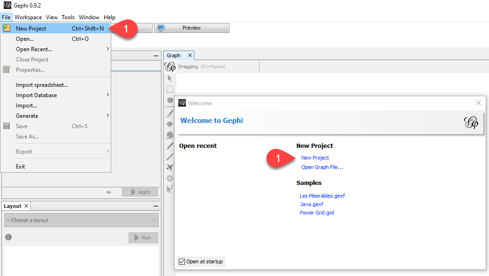

2.  Click on file and select ‘Import Spreadsheet’.

    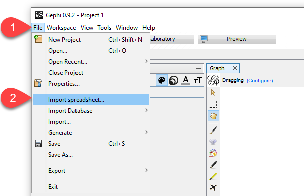

3.  Choose the quaker-nodes.csv file and choose open.

    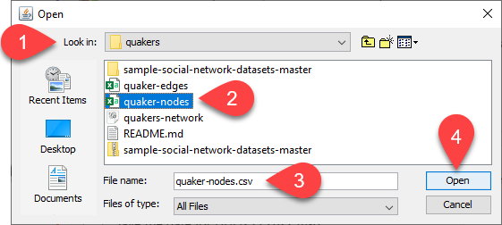

4.  You should see the import dialogue box. As shown below, Gephi should
    identify the file as a Nodes table, and you should see the columns
    from the csv.

    

5.  Click on Next and Finish to see the import report. The import report
    should show you that 96 nodes have been imported.

    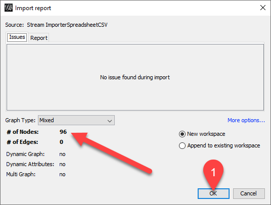

6.  Click on OK and your network will contain nodes!

    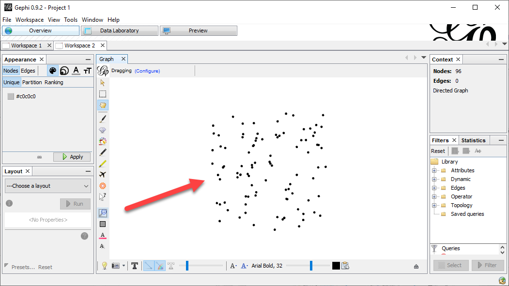

7.  Go through the same (above) process of importing a spreadsheet but
    select the quaker-edges.csv file. It should recognise the file as an
    edges table.

    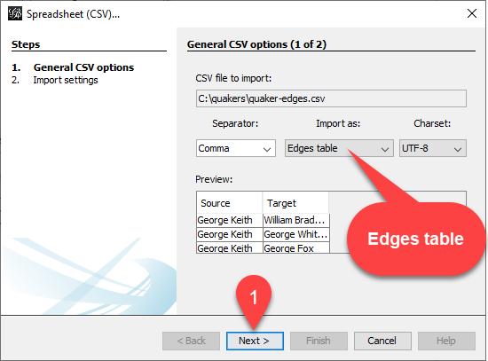

8.  Clicking Next and Finish, the import result should now show **96
    nodes** and **162 edges**.

    

9.  You should now see the network!

    

You can also load in the graphml file. This file contains both the nodes
and edges. To do so, click on File -> Open, select the
quakers-network.graphml file. The import report should show 92 nodes and
162 edges. **Make sure to select the ‘Append to existing workplace’
button before clicking OK.**

If you want to see your nodes and edges in a table format (to check
everything has loaded in correctly) then you can click on ‘Data
Laboratory’ and Nodes or Edges in the Data Table tab.

You can show the information about a node by selecting it in the
Overview Windows. Click on the pointer with question mark next to it
then click on a node in the network. The information for the node will
be shown in a tab on the left. Also, if you put your pointer over a node
then it will highlight connected nodes.

### Compare different layouts and networks

How can we explore the network? Well, we should first consider
interesting questions we can ask, such as:

-   Are there clusters of interconnected quakers?

-   Who is the most connected quaker and how do we identify this person
    in the network?

-   Is anyone almost completely isolated?

-   Does historical significance impact who is connected to whom?

-   What’s missing from the visualisation?

Feel free to come up with your own questions. It is an interesting
dataset!

Please take your time to explore the network. Three features of Gephi we
would point you to are:

1.  In the bottom left is a Layout tab. A layout positions the nodes
    according to an algorithm. Select a layout and then click Run.
    Consider what the layout is showing you. What does it tell you about
    the network? Note that running some layouts may take some time to
    complete; you may have to click Stop button if it is taken too long.
2.  You can calculate different statistics about a network. These are
    accessed via the statistics tab on the right. Clicking on Run will
    calculate the statistic and show some output. Where applicable,
    calculated information for each node will be shown in the Nodes tab
    of the Data Table.
3.  There is information about each node. You can see the information
    about each node in the Nodes section of the Data Table. In the
    Appearance tab you can set the appearance of each node based on
    other information about a node, such as Historical Significance,
    gender, birthdate, deathdate and information added by the
    statistics.
4.  You can show the labels for nodes by clicking on the T below the
    network graph.
5.  The Preview button at the top (after Overview, Data Laboratory) will
    show a stylised version of the graph when you click on preview. You
    can save the pretty version to SVG, PDF or PNG.

The above are suggestions. Explore the network and experiment :blush:

# Activity 2: Centrality plenary

So far, we have imported and visualised nodes and edges as a network (can also be called a graph or sociogram) as well as had a reflexive exercise using some questions. Although a useful exercise, it may be hard to examine the network by only observing it visually. To help us understand or examine the network further, there is the need to have a way to measure aspects of the network; this is where the concept of Centrality becomes useful. Centrality helps us to understand the importance of nodes (e.g., actors, people, etc.) and edges (e.g., links, connections, etc.) in a network. ***In a literal sense, Centrality is the quality or fact of being the main or most important part of something (a network in our case).***

Centrality as a concept in the study of social networks is very important. Although important, and like many concepts in research, it is not without criticisms – [particularly when it comes to graph theory](https://doi.org/10.1016/0378-8733(78)90021-7). Such criticisms and graph theories are beyond the scope of this workshop. [Early research](https://doi.org/10.1016/0378-8733(78)90021-7) in the 1940s and 50s tend to relate the concept to perception of leadership, group efficiency, personal satisfaction of participants. The centrality idea as related to human communication was first introduced under the direction of an American Psychosocialist [Alexander Bavelas](https://en.wikipedia.org/wiki/Alex_Bavelas) in the late 1940s; very early research application was done at the Group Networks Laboratory at MIT. ***In practice, there are several ways of measuring centrality using measures such as Degree, Betweenness, Closeness (this one is credited to Alexander Bavelas), among others. Each centrality measure tends to have its own definition of “importance” so it is important to understand their definition and how that could be applied to your research context*** (e.g., examining structures of power or prestige or visibility of group members). In this workshop, ***we will look at both Degree and Betweenness centrality measures***; we will adapt the content from [Cambridge Intelligence](https://cambridge-intelligence.com/keylines-faqs-social-network-analysis/) and [ScienceDirect](https://www.sciencedirect.com/topics/computer-science/degree-centrality). 

### Degree Centrality
Degree Centrality is considered the simplest centrality measure of node connectivity in a network; it is easy to compute.

**Definition:** Degree centrality is an importance score derived from counting the number of edges connected to each node in a network. Thus, a node having 3 edges will have a degree centrality measure of 3.

**What the measure tells us:** The measure indicates how many direct connections a node has to other nodes in the network.

**Application (when to use it):** The measure is usually considered when investigating connected nodes in a network. For example, popular quakers in the quakers network being explored; we will try and explore this later.

### Betweenness Centrality
**Definition:** Betweenness centrality indicates the number of times a node in each network lies on the shortest path between nodes of that network. The idea behind Betweenness Centrality is also linked to Alexander Bavelas’ idea in the 1948 that “a point in a communication network is central to the extent that it falls on the shortest path between pairs of other points” ([Source – Linton C. Freeman](https://doi.org/10.2307/3033543)).

**What the measure tells us:** Betweenness centrality measure can show important nodes that serve as “bridges” between other nodes in a network. We can measure the extent to which a node plays a bridging role or “betweenness” in a network.

**Application (when to use it):** The measure may be used, for example, to identify individuals (or nodes) who influence the information flow in a group or network. 

## Demonstrate centrality on Quaker dataset
This part will demonstrate how both the Degree and Betweenness centrality measures could be explored using Gephi. We will now go back to using Gephi to explore the two centrality measures.

### Degree Centrality demo
**Step 1.** Open Gephi and create a New Project

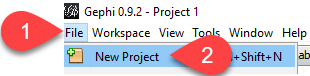

Step 2. Save empty project as **Project_centrality.gephi**

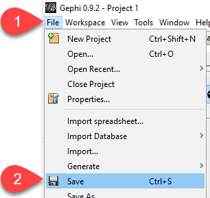 | 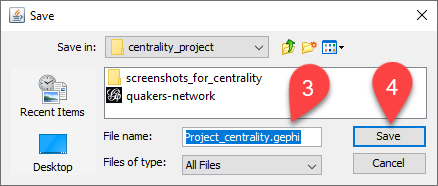

**Step 3.** Load the **quakers-network.graphml** file by going to **File -> Open… -> Select “Append to existing workspace” -> Click Ok button**

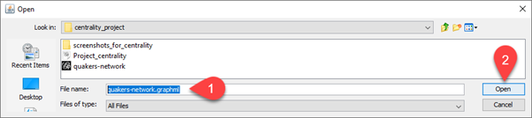 | 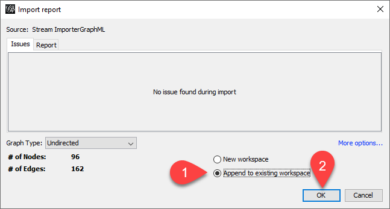

**Step 4.** Zoom-in graph on the white canvas so that it is centred but more legible. Tip: you can also use the middle of your mouse, if you have one, to zoom-in further.

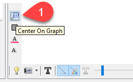

**Step 5.** Now we want to focus on the Nodes in the network and compute the Degree Centrality measure. We want to use colour coding that can given us some idea about more or less or middle connected nodes. As a random choice, let’s use a red-yellow-blue coding system/scheme where red is less connected, blue is more connected, and yellow is middle (i.e., somewhere in between more or less connected nodes). To do this, go to Appearance dialog -> Select Color -> Select Nodes -> Select Ranking -> Select Degree [this is the selection of Degree Centrality measure] -> Select Color Default -> Select the last Color-coding system (i.e., red-yellow-blue) -> Click Apply button.

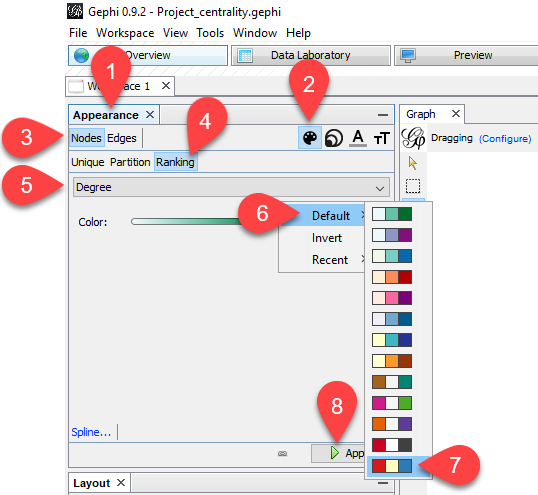

**Step 6.** You might have noticed that although there are differences in the color of the Nodes in terms of “connectedness” after computing the Degree Centrality measure, the sizes of the Nodes remain the same which may serve as blocker for interpretation or better visualisation. Let us try to use the steps in the screenshot below to alter the sizes of the Nodes to also reflect the Degree Centrality measure as applied to the color of the Nodes. Save project.

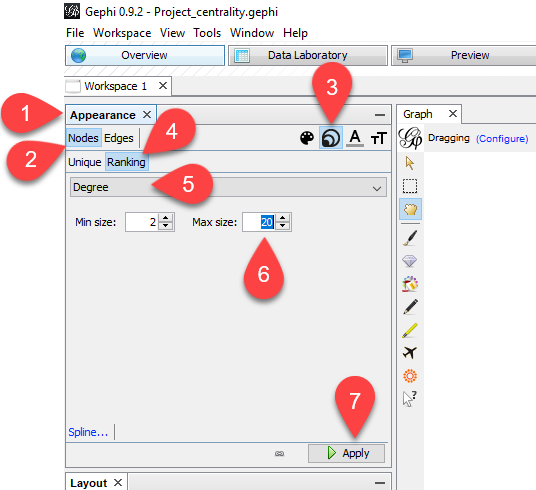

**Step 7.** This setup has a **question** about the output from Step 6 above which is: **How many Nodes do you think have many edges per Step 5 output (see screenshot below and recall the definition of Degree Centrality measure as well as the color scheme used)?** Save the project.

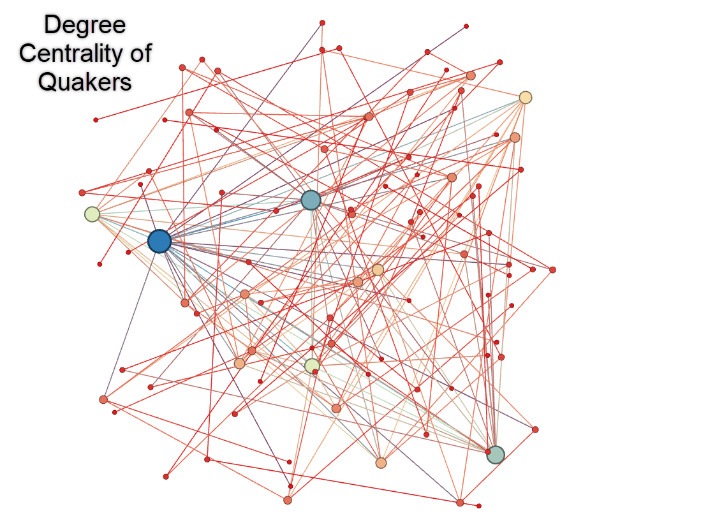

### Betweenness Centrality demo
Some of the steps here will be without screenshots given that previous section on Degree Centrality demo has dealt with them. 

**Step 1.** Open Gephi and create a New Project

**Step 2**. Save empty project as **Project_betweeness_centrality.gephi**

**Step 3.** Load the **quakers-network.graphml** file by going to **File -> Open… -> Select “Append to existing workspace” -> Click Ok button**

**Step 4.** Zoom-in graph on the white canvas so that it is centred but more legible. Tip: you can also use the middle of your mouse, if you have one, to zoom-in further.

**Step 5.** We need to compute Network Diameter (ND) statistics prior to calculating Betweenness Centrality. Go to Statistics dialog -> Network Diameter -> Click Run button -> Click Ok button in “Graph Distance settings dialog” -> Check HTML Report and close it. The ND is the longest graph-distance between any two Nodes in the Quakers Network or, in other words ND is answer to the question “How far are the two most distant Nodes in the network?”. Note that connected nodes have a graph distance of 1. 

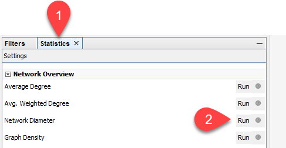

**Step 6.** Now let us compute Betweenness Centrality measure using same color scheme (see steps in screenshot below).

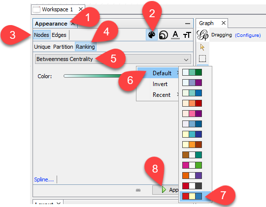

**Step 7.** Now let us compute Betweenness Centrality measure using same Node size scheme (see steps in screenshot below).

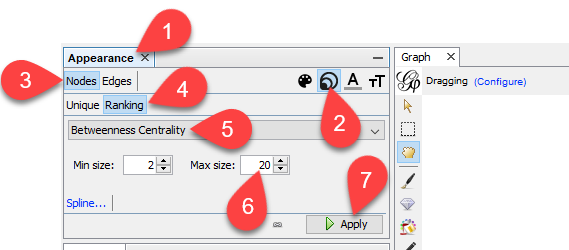

**Step 8.** Based on the output from Step 7 shown below, what are the important Nodes that appear to be serving as “bridges” or “betweenness” between other Nodes in a network?

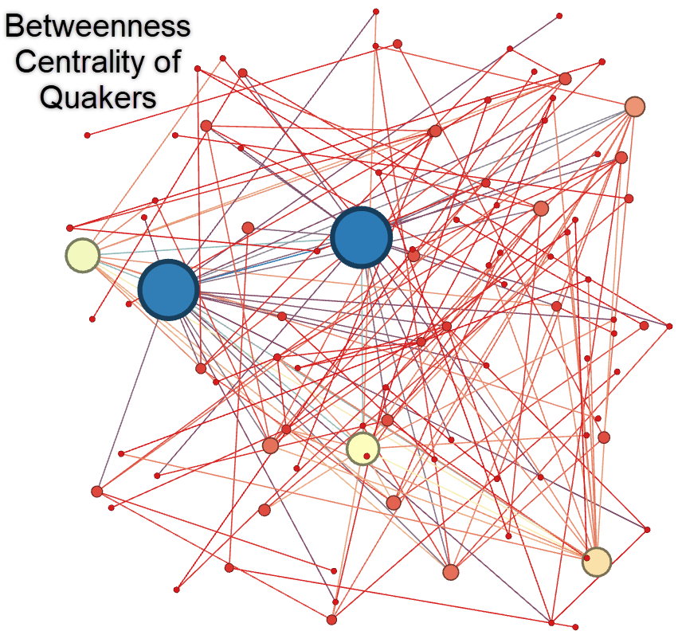

## Introduction to analytical/interpretive approaches

We have gone through several approaches in analysing the Quakers data (one possible area of interest, at least in this workshop), using variety of questions to interrogate what we have visualised as well as the measures we have computed in Gephi using the data. As a next step, we would like to introduce you to the “Resource B: Possible analytical approach” part of a [“How to guide” report or resource from Home Office gives an overview of social network analysis](https://assets.publishing.service.gov.uk/government/uploads/system/uploads/attachment_data/file/491572/socnet_howto.pdf) (Table below shows an adapted version). 

Knowing that validation is important in such analysis, we would like to probe further to find out the names linked to the Nodes and Google some of the names to see if we can find any useful information to convince us if these Quakers are indeed "influential" in the network. There may be several ways of identifying the names of Quakers behind the Nodes in the network. In our case, we will use the text dialog beneath the graph or white canvas in Gephi to label the Nodes in the network (see the four steps in screenshots below). 

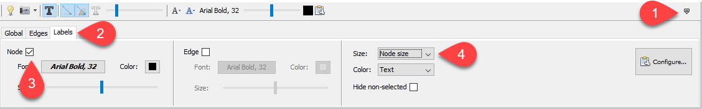

From the two maps below generated from computing the two measures, it appears that the most important Quakers might be George Fox and William Penn! As part of our validation questions (see Table below), we will use Google search engine to gather some information about these two people to validate our intuitive conclusion. 

**Task for everyone:** How many of you have studied or know much about George Fox? What do you find if you Google “George Fox”? Is what you know relevant to what you are seeing in the Quakers' network below?

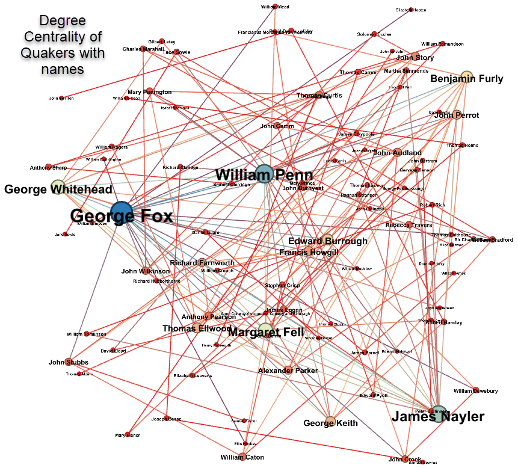 | 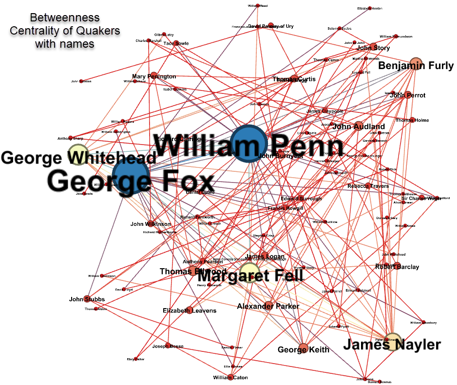

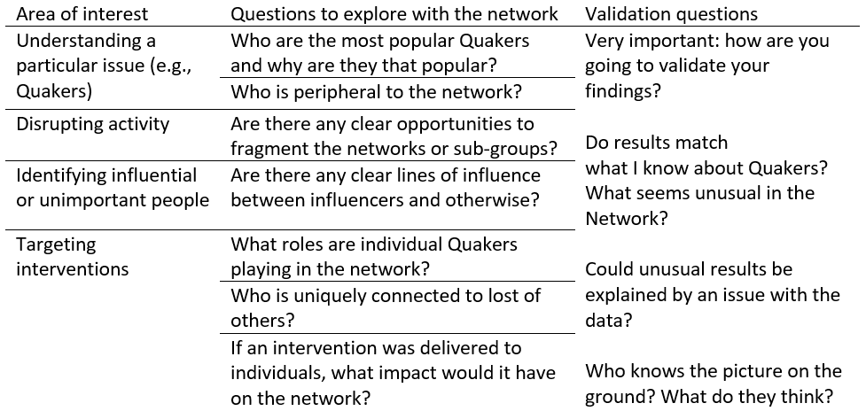

## Going Further

Networks are an interesting way to collect, form and explore
relationships we encounter in research data. You have worked with Gephi
to explore some networks and looked at interesting online based
projects.

What if you want to further and delve more into networks?

### Datasets

There is a large collection of network datasets available for you to
download. The below are just a few examples.

-   On the Gephi Github page you can find several networks in multiple
    different formats (which can all be opened in Gephi)
    [here](https://github.com/gephi/gephi/wiki/Datasets). Some of these
    are social networks. Others are from different domains such as
    computer science, bibliometrics, and for fun, such as the Marvel
    Social Network.

-   The sample social network datasets from which we chose the Quakers
    data. The repository is
    [here](https://github.com/melaniewalsh/sample-social-network-datasets)
    from which you can click Code and Download as Zip to download the
    data files.

-   The [Stanford Large Network Dataset
    Collection](https://snap.stanford.edu/data/index.html) lists lots of
    different networks. The files are .gz and you may need to install
    software such as 7-zip to extract these.

### Tutorials

-   For some papers including descriptions of network analysis see
    [Network Analysis - an overview \| ScienceDirect
    Topics](https://www.sciencedirect.com/topics/social-sciences/network-analysis)

-   A rather nice web based exploration of network concepts [An
    Interactive Introduction to Network Analysis and Representation
    (stanford.edu)](http://dhs.stanford.edu/dh/networks/)

-   The Programming Historian has several good tutorials including
    networks (see
    [here](https://programminghistorian.org/en/lessons/?topic=network-analysis)).
    In particular, this page gives some wonderful context and
    consideration to creating networks from historical sources [From
    Hermeneutics to Data to Networks: Data Extraction and Network
    Visualization of Historical Sources \| Programming
    Historian](https://programminghistorian.org/en/lessons/creating-network-diagrams-from-historical-sources)

-   [Martin Grandjean » Digital humanities, Data visualization, Network
    analysis » GEPHI – Introduction to Network Analysis and
    Visualization](http://www.martingrandjean.ch/gephi-introduction/)

-   [Creating a Network Graph with Gephi – DH101
    (miriamposner.com)](http://miriamposner.com/dh101f15/index.php/creating-a-network-graph-with-gephi/)

-   [Demystifying Networks, Parts I & II Journal of Digital
    Humanities](http://journalofdigitalhumanities.org/1-1/demystifying-networks-by-scott-weingart/)

### Papers and books

Here are a small selection of papers and books which may be helpful.

Ahnert, R., Ahnert, S. E., Coleman, C. N., & Weingart, S. B. (2020). The
Network Turn: Changing Perspectives in the Humanities. *Elements in
Publishing and Book Culture*. <https://doi.org/10.1017/9781108866804>

Conroy, M. (2021). Networks, Maps, and Time: Visualizing Historical
Networks Using Palladio. *Digital Humanities Quarterly*, *015*(1).

Donnellan, L. (2019). Modeling the Rise of the City: Early Urban
Networks in Southern Italy. *Frontiers in Digital Humanities*, *6*.
<https://www.frontiersin.org/article/10.3389/fdigh.2019.00015>

Finegold, M., Otis, J., Shalizi, C., Shore, D., Wang, L., & Warren, C.
(2016). Six Degrees of Francis Bacon: A Statistical Method for
Reconstructing Large Historical Social Networks. *Digital Humanities
Quarterly*, *10*(3). <https://hcommons.org/deposits/item/mla:989/>

Grandjean, M. (2016). A social network analysis of Twitter: Mapping the
digital humanities community. *Cogent Arts & Humanities*, *3*(1),
1171458. <https://doi.org/10.1080/23311983.2016.1171458>

Jacomy, M., Venturini, T., Heymann, S., & Bastian, M. (2014).
ForceAtlas2, a Continuous Graph Layout Algorithm for Handy Network
Visualization Designed for the Gephi Software. *PLOS ONE*, *9*(6),
e98679. <https://doi.org/10.1371/journal.pone.0098679>

Marres, N. (2015). Why Map Issues? On Controversy Analysis as a Digital
Method. *Science, Technology, & Human Values*, *40*(5), 655–686.
<https://doi.org/10.1177/0162243915574602>

Ryan, Y. C., & Ahnert, S. E. (2021). The measure of the archive: The
robustness of network analysis in early modern correspondence. *Journal
of Cultural Analytics*, *6*(3), 25943.

Tommaso, V., Jacomy, M., & Jensen, P. (2021). What do we see when we
look at networks: Visual network analysis, relational ambiguity, and
force-directed layouts. *Big Data & Society*, *8*(1).
<https://doi.org/10.1177/20539517211018488>

Venturini, T., Bounegru, L., Jacomy, M., & Gray, J. (2017). How to tell
stories with networks: Exploring the narrative affordances of graphs
with the Iliad. In *The Datafied Society: Studying Culture through Data*
(pp. 155–170). Amsterdam University Press.
