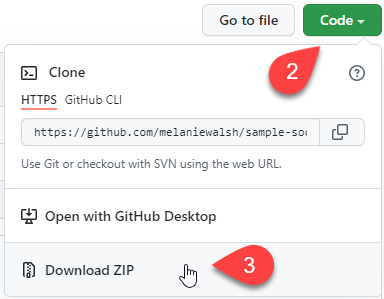
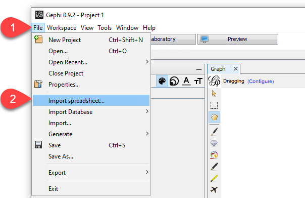

```{r setup, include=FALSE}
knitr::opts_chunk$set(echo = TRUE)
```

# Introduction

Do you want to learn a new skill as a historian? The Information and Digital Group Technology for Research (IDGT4R) team has been asked to lead an introductory practitioners' approach on the applications of social networks as a complimentary 90-minute component to a composite session (Networks: A Skills Workshop). This practical part to be preceded by a talk from Kate Davidson (Sheffield) on Social Network Analysis from her article on Early Modern Social Networks: Antecedents, Opportunities, and Challenges in American Historical Review.

## Learning objectives

• Upskill yourself with some techniques for exploring and visualizing social networks

• Load and explore historical network data using Gephi

• Visualise historical network data with Gephi

• Reflect on some of the technicalities around network analysis

## Requirements

• Properly installed Gephi software version 0.9.2. You can find installation guide here. Issues with Java, speak to helpdesk. Email if stuck. If you encounter Gephi issues with Java, then you can also look at this blog post and video

• Managed Windows Desktop access to Gephi or via Software Centre

• Access to a computer with internet connection for downloading data

• Data source for this workshop: Quakers

# Activity 1: Quakers Network

### Setup the folder for your work

Think about where on your computer that you want to work and create a folder there. Preferably with a short path like "C:\\quakers".

### Overview of the dataset and tabular content

Download the Quaker dataset as shown below in text and screenshots.

Go to the [sample data sets page](https://github.com/melaniewalsh/sample-social-network-datasets) -> Code -> Download Zipped folder into your project folder -> Unzip folder with software such as [7zip](https://www.7-zip.org/) -> navigate unzipped folder to "..\\sample-datasets\\quakers\\" and copy files into your Gephi project folder or keep them where they are and use in your Gephi project.

|                      |                      |
|----------------------|----------------------|
|  |  |

We are going to examine the relationships between 17th Century Quakers. We have downloaded the data from [Melanie Walsh's GitHub repository](https://github.com/melaniewalsh/sample-social-network-datasets/tree/master/sample-datasets/quakers) which contains other network datasets. The original data is taken from this [excellent Programming Historian tutorial](https://programminghistorian.org/en/lessons/exploring-and-analyzing-network-data-with-python). Please refer to these pages for more information about the network.

We have a total of 96 nodes. Each node is a Quaker. If a Quaker has a relationship with another Quaker then there is a line (edge) between the two nodes. You will notice that there are 3 data files:

1.  quaker-nodes.csv
2.  quaker-edges.csv
3.  quakers-network.graphml

The quaker-nodes.csv and quaker-edge.csv files contain the nodes and edges of our network respectively. The quaker-edges.csv file lists the edges between the different nodes. The quakers-network.graphml file contains both the nodes and edges of our network in one file.

Let us consider each of the files in turn:

#### quaker-nodes.csv

Each line contains the details of one node. You can view this file by opening it in Excel or online [here.](https://github.com/melaniewalsh/sample-social-network-datasets/blob/master/sample-datasets/quakers/quaker-nodes.csv) Each node has an id, a label, the historical significance of the quaker, their gender, birthdate, deathdate and something called other_id.

Have a look through the file and consider:

-   Are there more males than females?

-   What does the historical significance tell you?

-   Do you see any other trends?

#### quaker-edges.csv

Each line gives us the source and target node (you can view the file in Excel or online [here](https://github.com/melaniewalsh/sample-social-network-datasets/blob/master/sample-datasets/quakers/quaker-edges.csv)). Network software will use this file to raw a line (edge) between the source and target node, where the names in this file correspond to the label in the quaker-nodes.csv file. Briefly looking through the file, do you:

-   See any patterns?

-   Are some people very connected?

-   What do you think these patterns might mean?

#### quakers-network.graphml

Both the nodes and edges are included in this file. The file is formatted as xml (see the file [here](https://github.com/melaniewalsh/sample-social-network-datasets/blob/master/sample-datasets/quakers/quakers-network.graphml) if you are curious) which is usually written out by a piece of software for networks. We do not need to know much about this file as we have already familiarised ourselves with the nodes and edged in the previous files. The graphml file contains these nodes and edges, along with some further data about the colour and position the nodes should have.

### Import into Gephi and 'first draw'

We have our network data, but we want to see the network. The power of networks is in seeing the collective interconnections between nodes and exploring the emergent properties of the network – which we cannot see by examining nodes or edges in isolation.

One rather excellent piece of software for this is [Gephi](https://gephi.org/) (though alternative packages, including those for the R and Python programming languages, are [available](https://alternativeto.net/software/gephi/)).

Here we will go through the process of loading our csv files into Gephi (to create our network) and loading in the graphml file (our complete network).

1.  Click new project. Go to File -> New Project to create a new Gephi project file. Alternatively, you can use the link in the welcome dialog that pops up when you first open Gephi.

    

2.  Click on file and select 'Import Spreadsheet'

    

3.  Choose the quaker-nodes.csv file and choose open.

    

4.  You should see the import dialogue box. As shown below, Gephi should identify the file as a Nodes table, and you should see the columns from the csv.

    

5.  Click on Next and Finish to see the import report. The import report should show you that 96 nodes have been imported.

    

6.  Click on OK and your network will contain nodes!

    

7.  Go through the same (above) process of importing a spreadsheet but select the quaker-edges.csv file. It should recognise the file as an edges table.

    

8.  Clicking Next and Finish, the import result should now show **96 nodes** and **162 edges**.

    

9.  You should now see the network!

    

You can also load in the graphml file. This file contains both the nodes and edges. To do so, click on File -> Open, select the quakers-network.graphml file. The import report should show 92 nodes and 162 edges. **Make sure to select the 'Append to existing workplace' button before clicking OK.**


If you want to see your nodes and edges in a table format (to check everything has loaded in correctly) then you can click on 'Data Laboratory' and Nodes or Edges in the Data Table tab.


You can show the information about a node by selecting it in the Overview Windows. Click on the pointer with question mark next to it then click on a node in the network. The information for the node will be shown in a tab on the left. Also, if you put your pointer over a node then it will highlight connected nodes.


### Compare different layouts and networks

How can we explore the network? Well, we should first consider interesting
questions we can ask, such as:

-   Are there clusters of interconnected quakers?

-   Who is the most connected quaker and how do we
    identify this person in the network?

-   Is anyone almost completely isolated?

-   Does historical significance impact who is
    connected to whom?

-   What's missing from the visualisation?

Feel free to come up with your own questions. It is an interesting dataset!

Please take your time to explore the network. Three features of Gephi we would point you to are:

1.  In the bottom left is a Layout tab. A layout positions the nodes according to an algorithm. Select a layout and then click Run. Consider what the layout is showing you. What does it tell you about the network? Note that running some layouts may take some time to complete; you may have to click Stop button if it is taken too long.
2.  You can calculate different statistics about a network. These are accessed via the statistics tab on the right. Clicking on Run will calculate the statistic and show some output. Where applicable, calculated information for each node will be shown in the Nodes tab of the Data Table.
3.  There is information about each node. You can see the information about each node in the Nodes section of the Data Table. In the Appearance tab you can set the appearance of each node based on other information about a node, such as Historical Significance, gender, birthdate, deathdate and information added by the statistics.
4.  You can show the labels for nodes by clicking on
    the T below the network graph.
5.  The Preview button at the top (after Overview,
    Data Laboratory) will show a stylised version of the graph when you click on
    preview. You can save the pretty version to SVG, PDF or PNG.

The above are suggestions. Explore the network and experiment :blush:

[Other content here]

## Going Further

Networks are an interesting way to collect, form and explore relationships we encounter in research data. You have worked with Gephi to explore some networks and looked at interesting online based projects.

What if you want to further and delve more into networks?

### Datasets

There is a large collection of network datasets available for you to download. The below are just a few examples.

-   On the Gephi Github page you can find several networks in multiple different formats (which can all be opened in Gephi) [here](https://github.com/gephi/gephi/wiki/Datasets). Some of these are social networks. Others are from different domains such as computer science, bibliometrics, and for fun, such as the Marvel Social Network.

-   The sample social network datasets from which we chose the Quakers data. The repository is [here](https://github.com/melaniewalsh/sample-social-network-datasets) from which you can click Code and Download as Zip to download the data files.

-   The [Stanford Large Network Dataset Collection](https://snap.stanford.edu/data/index.html) lists lots of different networks. The files are .gz and you may need to install software such as 7-zip to extract these.

### Tutorials

-   For some papers including descriptions of network analysis see [Network Analysis - an overview \| ScienceDirect Topics](https://www.sciencedirect.com/topics/social-sciences/network-analysis)

-   A rather nice web based exploration of network concepts [An Interactive Introduction to Network Analysis and Representation (stanford.edu)](http://dhs.stanford.edu/dh/networks/)

-   The Programming Historian has several good tutorials including networks (see [here](https://programminghistorian.org/en/lessons/?topic=network-analysis)). In particular, this page gives some wonderful context and consideration to creating networks from historical sources [From Hermeneutics to Data to Networks: Data Extraction and Network Visualization of Historical Sources \| Programming Historian](https://programminghistorian.org/en/lessons/creating-network-diagrams-from-historical-sources) .

-   [Martin Grandjean »
    Digital humanities, Data visualization, Network analysis » GEPHI – Introduction
    to Network Analysis and Visualization](http://www.martingrandjean.ch/gephi-introduction/)

-   [Creating a Network Graph with Gephi – DH101 (miriamposner.com)](http://miriamposner.com/dh101f15/index.php/creating-a-network-graph-with-gephi/)

-   [Demystifying Networks, Parts I & II Journal of Digital Humanities](http://journalofdigitalhumanities.org/1-1/demystifying-networks-by-scott-weingart/)

### Papers and books

Here are a small selection of papers and books which may be helpful.

Ahnert, R., Ahnert, S. E., Coleman, C. N., & Weingart, S. B. (2020). The Network Turn: Changing Perspectives in the Humanities. *Elements in Publishing and Book Culture*. <https://doi.org/10.1017/9781108866804>

Conroy, M. (2021). Networks, Maps, and Time: Visualizing Historical Networks Using Palladio. *Digital Humanities Quarterly*, *015*(1).

Donnellan, L. (2019). Modeling the Rise of the City: Early Urban Networks in Southern Italy. *Frontiers in Digital Humanities*, *6*. <https://www.frontiersin.org/article/10.3389/fdigh.2019.00015>

Finegold, M., Otis, J., Shalizi, C., Shore, D., Wang, L., & Warren, C. (2016). Six Degrees of Francis Bacon: A Statistical Method for Reconstructing Large Historical Social Networks. *Digital Humanities Quarterly*, *10*(3). <https://hcommons.org/deposits/item/mla:989/>

Grandjean, M. (2016). A social network analysis of Twitter: Mapping the digital humanities community. *Cogent Arts & Humanities*, *3*(1), 1171458. <https://doi.org/10.1080/23311983.2016.1171458>

Jacomy, M., Venturini, T., Heymann, S., & Bastian, M. (2014). ForceAtlas2, a Continuous Graph Layout Algorithm for Handy Network Visualization Designed for the Gephi Software. *PLOS ONE*, *9*(6), e98679. <https://doi.org/10.1371/journal.pone.0098679>

Marres, N. (2015). Why Map Issues? On Controversy Analysis as a Digital Method. *Science, Technology, & Human Values*, *40*(5), 655–686. <https://doi.org/10.1177/0162243915574602>

Ryan, Y. C., & Ahnert, S. E. (2021). The measure of the archive: The robustness of network analysis in early modern correspondence. *Journal of Cultural Analytics*, *6*(3), 25943.

Tommaso, V., Jacomy, M., & Jensen, P. (2021). What do we see when we look at networks: Visual network analysis, relational ambiguity, and force-directed layouts. *Big Data & Society*, *8*(1). <https://doi.org/10.1177/20539517211018488>

Venturini, T., Bounegru, L., Jacomy, M., & Gray, J. (2017). How to tell stories with networks: Exploring the narrative affordances of graphs with the Iliad. In *The Datafied Society: Studying Culture through Data* (pp. 155–170). Amsterdam University Press.
